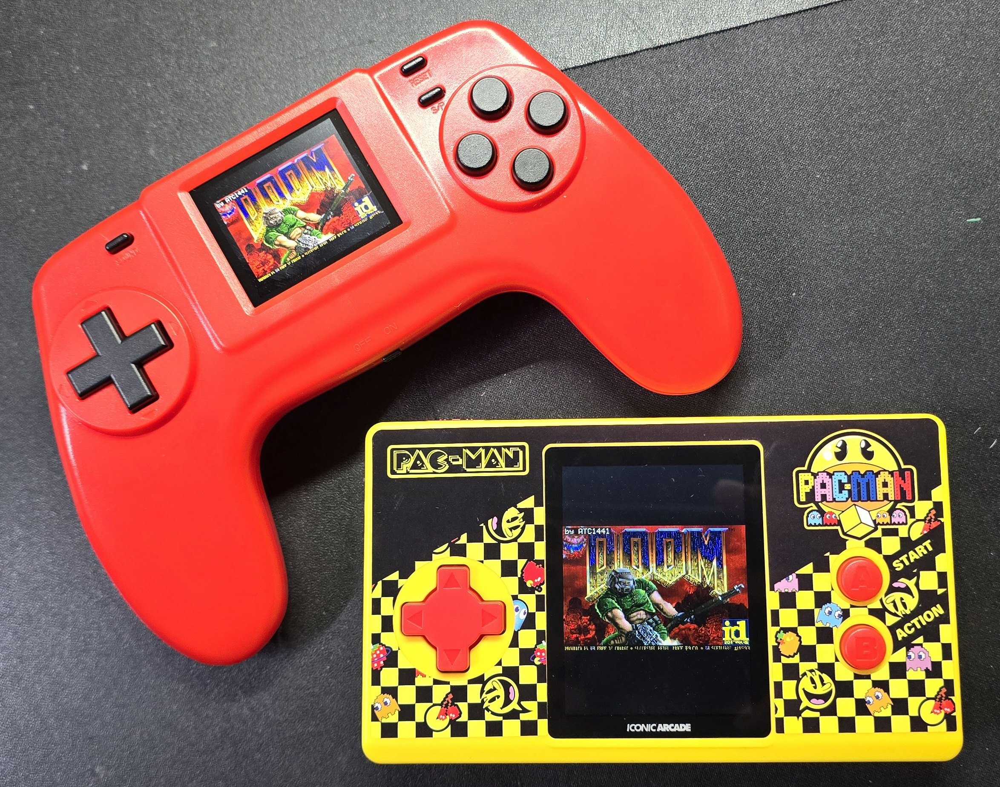
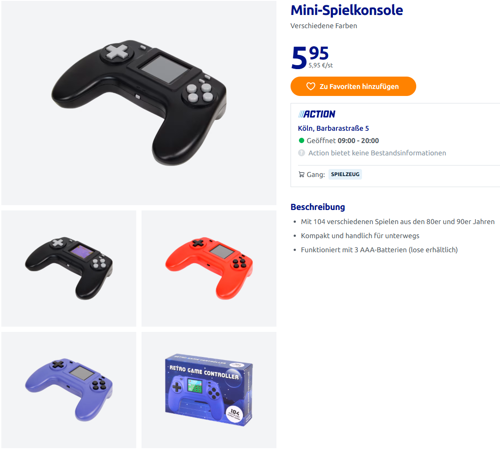
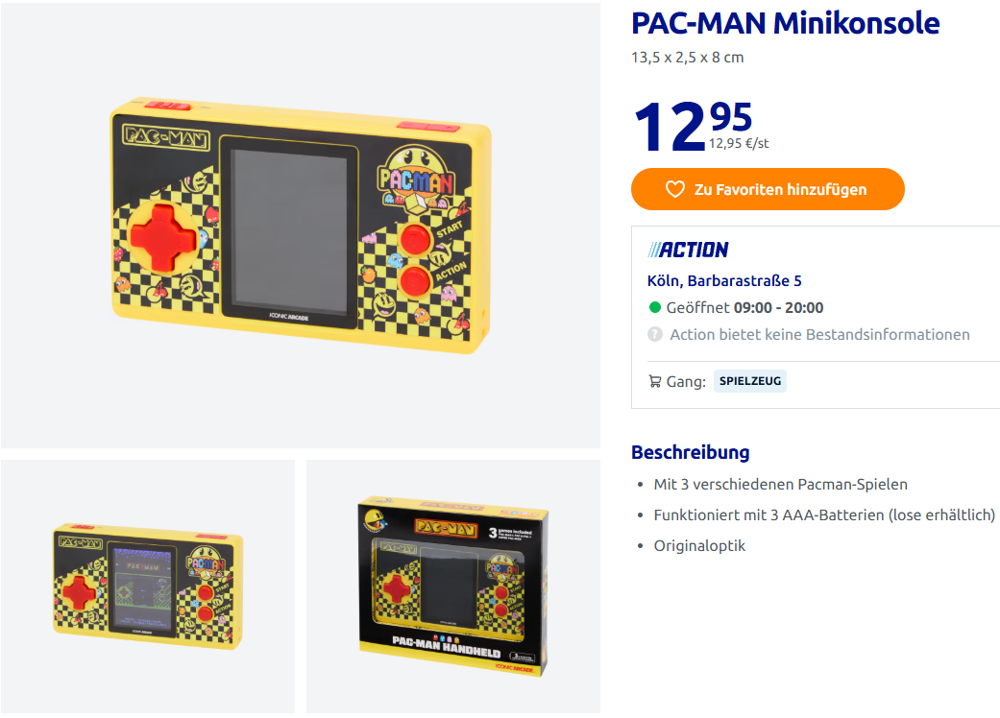
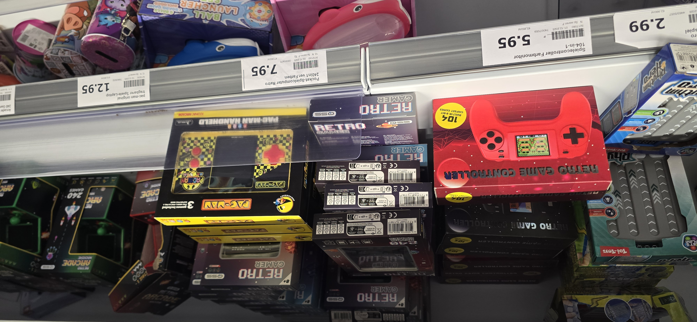
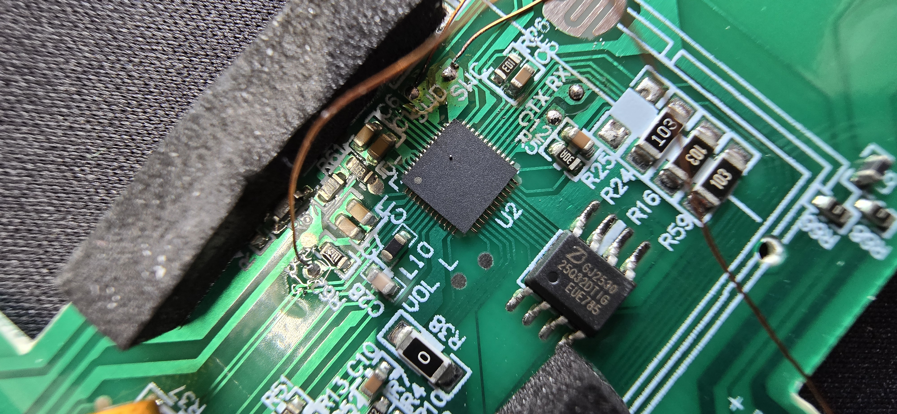
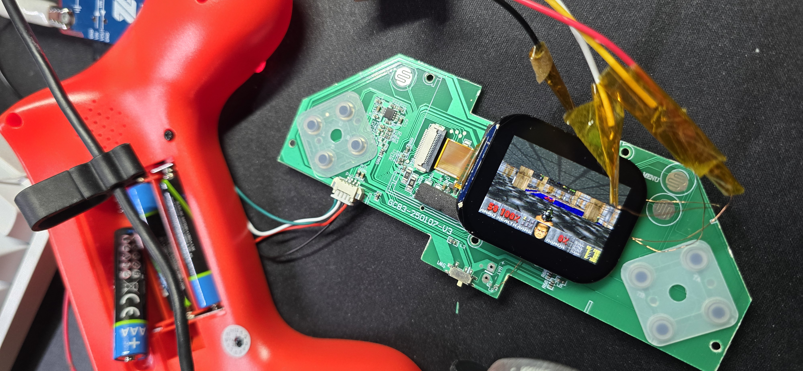
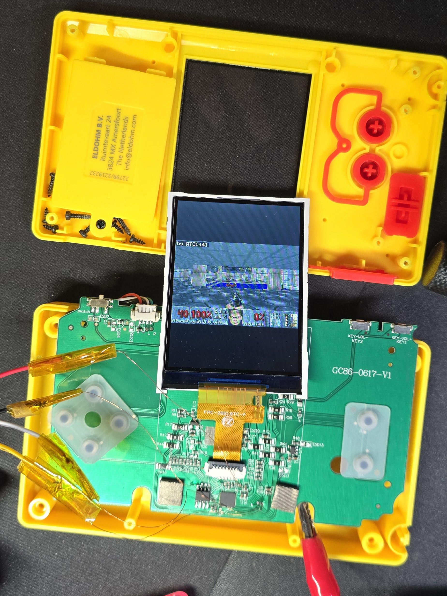

# DOOM on two Action mini game consoles



[](https://www.youtube.com/watch?v=jsV_npCriD4)

This repo is made together with this explanation video:(click on it)

DOOM running on two cheap handhelds sold by the Dutch discounter Action.
No hardware modifications on either - the stock firmware is replaced over
the SWD pads that are already on the board.

[](../../actions/workflows/build.yml)

**Prebuilt binaries are on the [releases page](../../releases)** - one
image per console plus the WAD, rebuilt on every push.

Both are built around the same nameless QFN48 SoC. There is no datasheet,
no SDK and no vendor documentation for it. Everything in this repository -
the register map, the panel init sequences, the button matrices - was
reconstructed from the two stock firmwares and verified on the devices.

## The two consoles

| | 104 Games | PAC-MAN |
|---|---|---|
| Shop | [article 3217060](https://www.action.com/de-de/p/3217060/mini-spielkonsole/) | [article 3219232](https://www.action.com/de-de/p/3219232/pac-man-minikonsole/) |
| Price | EUR 5.95 | EUR 12.95 |
| Board | `GC83-250107-V3` | `GC86-0617-V1` |
| Buttons | 11 - d-pad, four on the right, MENU, START, volume button | 8 - d-pad, A, B, VOL+, VOL- |
| Stock firmware | FlyThings/ZKSWE with an NES emulator | licensed Bandai Namco arcade emulator, C++ |
| Panel | 320x240, landscape in the case | 320x240, turned 90 degrees in the case |
| Build | `make` | `make BOARD=pacman` |

| | |
|---|---|
|  |  |



*Where it starts - both units sit on the same shelf.*

---

## What works

On **both** consoles:

* DOOM (shareware E1M1) at a playable frame rate
* **~194 MHz PLL**, matching stock. MPI retune runs from RAM; flash the
  image with the probe leaving the core halted and power-cycle with SWD
  idle so the debugger is not attached across the clock source switch
* **Sound effects** through the DAC at `0x40012C00`, DMA channel 0, mixer
  in `firmware/port/i_sound_console.c`. Menu blips and in-game SFX are
  confirmed. The WAD at `0x08090000` includes the `DS*` lumps
* Every button - eleven on the 104 Games, eight on the Pac-Man. On the
  104 Games the **volume button** ping-pongs four software gains (loud /
  mid / quiet / mute), as the stock firmware did. Pac-Man's VOL+/VOL-
  stay START and SELECT
* Correct colours and orientation from a cold start, with no dependency on
  what the stock firmware left behind
* Flashing and full recovery over SWD, no soldering beyond the debug wires

## What does not

* **No music.** DOOM's MUS lumps would need a synth; that is left out on
  purpose. Effects only.
* **The screen wipe looks wrong.** Front and back buffer share memory to
  save 38 KB.
* Only one map fits alongside the firmware and the sound lumps in 4 MB, so
  the WAD here is trimmed to E1M1.

---

## The SoC, shared by both



*The unmarked QFN48 (`U2`) and the Zbit 25Q32 next to it - the same pair on
both boards.*

| | |
|---|---|
| Core | **STAR-MC1** (Arm China), ARMv8-M Mainline, Cortex-M33 compatible, CPUID `0x631F1320`. Manufacturer never identified. |
| RAM | 280 KB SRAM at `0x20000000` (measured - a read at `0x20046000` resets the chip) |
| Flash | Zbit ZB25VQ32, 4 MB, W25Q command compatible, memory-mapped at `0x08000000` |
| Boot ROM | 32 KB on-chip, **byte-identical on both consoles** - same mask ROM |
| Clock | 16 MHz from the bootloader, ~62 MHz after SystemInit, **~194 MHz** after `clock_boost()` |
| Power | 3x AAA |

The peripheral base addresses look exactly like an STM32L4 (RCC at
`0x40021000`, GPIO at `0x48000000`). The register layouts do not - GPIO
input is at `+0x0C`, BSRR at `+0x14`, pull config at `+0x08`. Reaching for
an STM32 SDK here will waste your afternoon.

Because the boot ROM is identical, the flashing tools work unchanged on
both boards. What differs is everything above it: the two stock firmwares
share no code at all.

Full details in [docs/HARDWARE.md](docs/HARDWARE.md).

---

## 104 Games



Stock firmware: **FlyThings** by [ZKSWE](http://www.zkswe.com) (`Power by
FlythingLite`, `unsupport platform, please contact www.zkswe.com`) with an
NES emulator on top. That string is the best lead anyone has on who
actually makes this chip.

Buttons, read out of the stock key scan and then confirmed by pressing
every one while watching the input registers:

| Button | Pin | Button | Pin |
|---|---|---|---|
| D-pad up | PB7 | right 1 (top) | PA12 |
| D-pad down | PB5 | right 2 | PC6 |
| D-pad left | PB6 | right 3 | PA11 |
| D-pad right | PB4 | right 4 (bottom) | PB0 |
| START | PC8 | MENU | PC7 |
| Volume button | PA0 / PB2 / PC13 (stock polls all three; one is wired) | | |

The bit order the stock firmware builds is an NES joypad byte, which fits
an NES emulator exactly. The two turbo buttons are OR'ed onto A and B
there; here they become L and R, because DOOM has better uses for them.

The panel is driven in landscape and PA8 is its backlight.

---

## PAC-MAN



*Board `GC86-0617-V1`. Note the silkscreen top right: `KEY-VOL-` and
`KEY-VOL+`, the two buttons that become SELECT and START.*

Stock firmware: a licensed Bandai Namco arcade emulator ("Featuring Moo
Emulation", build V.289.1 Aug 12 2025) written in C++. It shares nothing
with the other board's, so nothing could be lifted from its disassembly
wholesale.

| Button | Pin | | Button | Pin |
|---|---|---|---|---|
| D-pad up | PB7 | | A | PB0 |
| D-pad down | PB5 | | B | PA11 |
| D-pad left | PB6 | | VOL+ -> START | PA0 |
| D-pad right | PB4 | | VOL- -> SELECT | PB2 |

The wiring turned out to be identical to the 104 Games board - the same
pins carry the d-pad, A and B. This console simply populates fewer of them,
and its VOL+/VOL- sit on pins the other board uses for volume. VOL+ and
VOL- become START and SELECT because DOOM needs those and there is nothing
else left; there is no strafe key here.

### Two things that cost time, in case they help elsewhere

**PA8 is the panel RESET here, not the backlight.** That one pin is the
whole difference between a port that works and one that only appears to.
Carrying the 104 Games meaning across and holding it high meant the
controller was never reset: from a cold start it came up undefined and
showed a plain white raster while the firmware happily sent it an init and
a picture. It looked fine the rest of the time, because flashing does not
cut power and the stock firmware's setup survived. The stock code pulses it
low at `0x08016B98` and waits before sending anything.

**This panel ignores MADCTL.** Four values were tried, including from a
clean cold start with the full init in place, and one with the BGR bit
cleared that must swap red and blue if it arrives. Nothing moved. So the
rotation is done in software on the way to the panel, which costs one extra
pass over a line buffer that is being built anyway.

Its panel init - 78 bytes, 25 commands - came out of the stock firmware
statically. It is the same controller family as the other board with
different parameters, not a different part: MADCTL `0x28` instead of
`0xE8`, an extra `0x21` for display inversion, and its own timing, power
and gamma values. Those gamma curves are why the picture looked darker
while it was still running on the stock configuration.

---

## Building

Needs `arm-none-eabi-gcc` (tested with 10.3.1) and `make`.

```sh
cd firmware
make                       # -> build/action104/doom.bin
make BOARD=pacman          # -> build/pacman/doom.bin
```

Board-specific pins, panel init and button map live in
`firmware/boards/<board>/board.h`. Nothing else in the firmware knows which
console it is being built for - adding a third means writing one more of
those, and [docs/PORTING.md](docs/PORTING.md) describes how the two
existing ones were worked out.

---

## Flashing

Identical for both consoles apart from which image you write.
**Read [docs/FLASHING.md](docs/FLASHING.md) before you start**, in
particular the part about dumping the stock firmware first. Short version:

### 1. Wire up SWD

Two pads next to the SoC, plus ground and VTref. On the 104 Games board
they are labelled `SWC`/`SWD` in the silkscreen; on the Pac-Man board they
are the pair marked in the photo in [docs/FLASHING.md](docs/FLASHING.md).


### 2. Save the stock firmware

```sh
cd tools/flashwriter && make && cd ..
python flash.py read stock_backup.bin 0x08000000 0x400000
# or: python flash_openocd.py read stock_backup.bin 0x08000000 0x400000
```

Do not skip this. It is the only way back to the original console, and this
repository would not exist without those two dumps.

### 3. Write DOOM and the WAD

The image runs the PLL. **Do not leave SWD attached across that switch**
(it desyncs the MEM-AP). Flash with `--leave-halted` and power-cycle with
the probe idle:

```sh
python flash.py write ../firmware/build/action104/doom.bin 0x08004000 --leave-halted
python flash.py write ../wad/doom1_e1m1_sfx.wad            0x08090000 --leave-halted
# CMSIS-DAP / OpenOCD: flash_openocd.py, same arguments
```

J-Link (`flash.py`) and OpenOCD (`flash_openocd.py`) share the RAM writer
and the `--leave-halted` flag. Use `build/pacman/doom.bin` for the other
console; the WAD is the same.

The bootloader at `0x00000000` is untouched and keeps working - it is what
jumps to `0x08004000`. Secure boot is not active: the bootloader validates
nothing, which was verified by breakpointing it.

### Getting back

```sh
python flash.py write stock_backup.bin 0x08000000
```

If a bad flash leaves a console unreachable over SWD, `tools/rescue.py`
(J-Link) or `tools/rescue_openocd.py` (CMSIS-DAP) catches the core in the
window between power-on and the crash. See
[docs/FLASHING.md](docs/FLASHING.md#when-swd-stops-responding).

---

## Repository layout

```
.github/workflows/ CI: builds both consoles and publishes a release
firmware/          the DOOM firmware, standalone build
  boards/          per-board pins, panel init, button map
    action104/     the 104 Games console
    pacman/        the PAC-MAN console
  sdk/             clock, LCD, input, audio DMA, mailbox, startup
  port/            GBADoom's platform layer (including the mixer)
  GBADoom/         vendored engine + engine-patches.diff
tools/             flash.py (J-Link), flash_openocd.py (CMSIS-DAP), RAM writer, rescue
wad/               trimmed shareware WAD (E1M1 + DS* sound lumps)
dumps/             stock firmware and boot ROM, one folder per console
docs/              hardware notes, flashing guide, porting guide
images/            hardware photos and product listings
```

---

## Credits

* **[doomhack/GBADoom](https://github.com/doomhack/GBADoom)** - the DOOM engine
  this port is built on, itself based on prboom. GBADoom was the right choice
  because it reads the WAD by pointer straight out of cartridge ROM, which
  maps perfectly onto these consoles' memory-mapped SPI flash. Upstream commit
  `89097b3`. Six files are changed - heap size, time base, a missing
  include that newer compilers reject, and three that only matter because
  the WAD here holds a single map. All of them are
  listed in [`firmware/GBADoom/engine-patches.diff`](firmware/GBADoom/engine-patches.diff)
  and commented in place.
* **id Software** - DOOM. The WAD here is the freely redistributable shareware
  IWAD, trimmed to a single map. The DOOM source code is GPL v2.
* **[atc1441/TXW818_WalkieTalkie_Doom](https://github.com/atc1441/TXW818_WalkieTalkie_Doom)**
  - reference for how to get GBADoom onto a small Cortex-M with a SPI panel.
* **[NordicPlayground/nrf-doom](https://github.com/NordicPlayground/nrf-doom)**
  - useful comparison for memory budgeting.
* Product photos of the consoles are screenshots from Action's own shop pages.

## Licence

GPL v2, inherited from GBADoom and the DOOM source release. See
[LICENSE](LICENSE).

The contents of `dumps/` are neither ours nor GPL - they are the vendors'
stock firmware, included so the reverse engineering can be checked. See
[dumps/README.md](dumps/README.md).

## Disclaimer

This overwrites the firmware of a device you bought. It is recoverable if
you made the backup in step 2, and not if you did not. Nobody involved with
Action or either manufacturer had anything to do with this.
