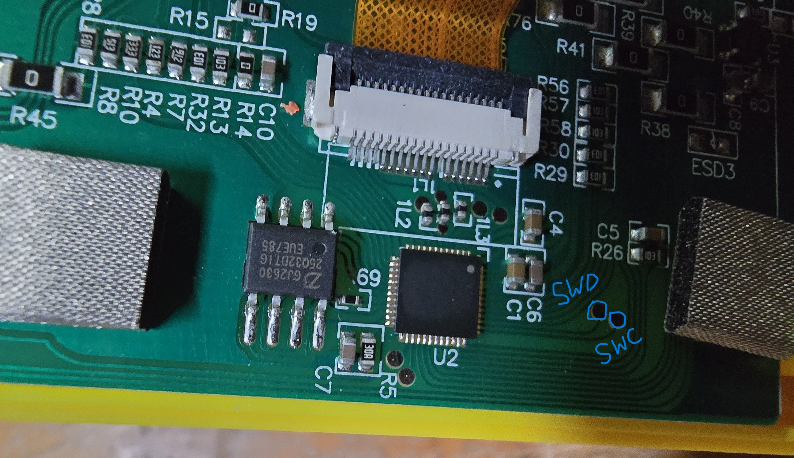
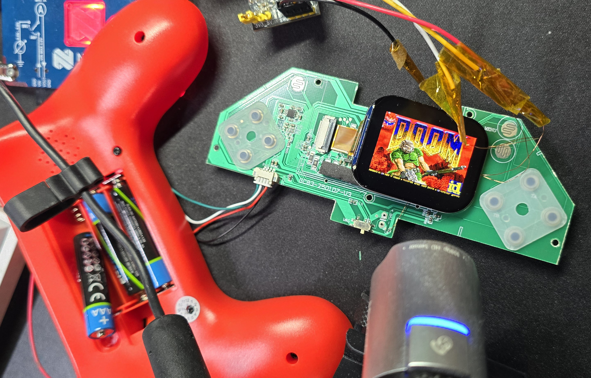

# Flashing

Everything here needs one thing only: a SWD probe. A SEGGER J-Link is what
this was developed with; anything that speaks SWD and can read and write
memory will do, but the scripts here use [pylink](https://pypi.org/project/pylink-square/)
and therefore a J-Link.

For 194 MHz images, pass `--leave-halted` and power-cycle with the probe
idle so SWD is not attached across the PLL source switch.

```sh
pip install pylink-square
```

## Wiring

The SWD pads sit next to the SoC and are labelled `SWC` (clock) and `SWD`
(data) in the silkscreen. You need three wires plus power:

| Probe | Console |
|---|---|
| SWCLK | `SWC` pad |
| SWDIO | `SWD` pad |
| GND | any ground |
| VTref | 3.3 V rail (so the probe knows the target voltage) |

Power the console however you like - batteries in, or 5 V on the USB
input. The probe does not supply it.

**VTref is not optional.** Without it the probe reports `VTref=0.000V` and
refuses to connect, even though the console is powered and drawing normal
current - which reads exactly like a dead target. Some J-Link adapters
have a jumper between VTref and 3V3; check it before suspecting anything
else.



*The two pads on the Pac-Man board, marked in blue. `U2` is the SoC, the
eight-pin part to its left is the SPI flash. The 104-games board has the
same pair, labelled `SWC`/`SWD` in the silkscreen.*



`nRESET` is not wired out on this board, so connect-under-reset is not
available. That matters only if something goes wrong; see the last section.

## Build the RAM writer

J-Link has no flash algorithm for this SoC's SPI controller, so flashing
goes through a small writer that runs from RAM. Build it once:

```sh
cd tools/flashwriter
make                                   # or: make CROSS=/path/to/arm-none-eabi-
```

## 1. Dump the stock firmware first

```sh
cd tools
python flash.py read stock_backup.bin 0x08000000 0x400000
```

This takes a couple of minutes and is the single most important step. It is
the only route back to the original console, and everything in this
repository - the register map, the panel init sequence, the button matrix -
came out of exactly this dump.

Sanity check that the probe is talking to the flash at all:

```sh
python flash.py id
# JEDEC id: 0x5E4016  manufacturer 0x5E, type 0x40, capacity 0x16 = 4 MB
#   -> Zbit
```

## 2. Flash DOOM

The image enables the 194 MHz PLL. Flash it **halted**, then power-cycle
with the debugger disconnected:

```sh
python flash.py write ../firmware/build/action104/doom.bin 0x08004000 --leave-halted
python flash.py write ../wad/doom1_e1m1_sfx.wad            0x08090000 --leave-halted
```


Unplug the probe, then power-cycle. Do not resume with SWD still attached.

### Flash layout

| Range | Contents |
|---|---|
| `0x00000000` | Boot ROM, on-chip, 32 KB - not writable, not touched |
| `0x08000000`-`0x08003FFF` | Bootloader in the SPI flash. Leave it alone: it is what jumps to `0x08004000`. |
| `0x08004000`-`0x0808FFFF` | Application. DOOM goes here, ~545 KB. |
| `0x08090000`-`0x083FFFFF` | WAD (E1M1 + `DS*` lumps), read by pointer through XIP. |

Secure boot is not active - the bootloader validates nothing before
jumping. That was verified by breakpointing it, not assumed.

## 3. Going back

```sh
python flash.py write stock_backup.bin 0x08000000
```

The console is exactly as it was.

## When SWD stops responding

If you flash firmware that hangs early - a bad clock change, a bad pin
setup - the debug port goes away with it. The symptom is unmistakable:
VTref reads a healthy ~3 V, the console draws current, and J-Link still
says `Failed to attach to CPU`. Power-cycling alone does not help, because
the same broken firmware restarts and hangs again within milliseconds.

```sh
cd tools
python rescue.py --write ../firmware/build/action104/doom.bin --addr 0x08004000
```

Start it, then interrupt the console's power repeatedly - pull a battery,
unplug USB, flip the switch - once every second or two. The script hammers
connect-and-halt attempts; one of them eventually lands in the window
between power-on and the crash, and it flashes immediately from that same
connection.

Two failure modes worth knowing, because both look like dead hardware:

* **`wfi` in a fault handler powers the debug domain down.** If your own
  code spins on `wfi` after a crash, you cannot attach at all. This
  firmware uses `for(;;){}` everywhere for exactly that reason.
* **Writing GPIO registers over SWD wedges the debug bus**, running core or
  halted, and needs a power cycle. Never configure pins from the host; have
  the firmware do it and read SRAM instead.
* **Attaching SWD across the PLL source switch** (`RCC+0x1C` source = 3)
  desyncs the MEM-AP. Power-cycle with the probe idle, then attach. This is
  not a hung CPU - the console is usually running fine.

Neither is recoverable by being clever with the debugger, and neither
damages anything - a power cycle plus `rescue.py` always got the console
back during development.
